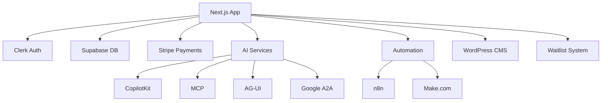

# 🚀 MicroSaaS Boilerplate 2025

A complete, production-ready Next.js 15 MicroSaaS boilerplate with modern integrations, AI capabilities, and automation features.

## ✨ Features

### 🔐 Authentication & Database
- **Clerk Authentication** - Complete user management with social logins
- **Supabase Database** - PostgreSQL with Row Level Security (RLS)
- **Real-time sync** - Webhook-based synchronization between Clerk and Supabase

### 💳 Payments & Billing
- **Stripe Integration** - Subscriptions, one-time payments, customer portal
- **European VAT compliance** - Automatic tax calculation
- **Invoice generation** - Custom PDF invoices with branding
- **Webhook handling** - Complete payment lifecycle management

### 🤖 AI Integrations
- **CopilotKit** - AI chat assistant with context awareness
- **Model Context Protocol (MCP)** - Advanced AI tool execution
- **AG-UI Protocol** - AI-generated UI components
- **Google A2A Protocol** - Agent-to-agent communication

### ⚡ Automation
- **n8n Integration** - Visual workflow automation
- **Make.com Integration** - Advanced scenario automation
- **Webhook management** - Secure event handling

### 🎨 Modern UI/UX
- **shadcn/ui Components** - Beautiful, accessible components
- **Tailwind CSS** - Utility-first styling
- **Dark mode support** - System preference detection
- **Responsive design** - Mobile-first approach

### 🔧 Developer Experience
- **TypeScript** - Full type safety
- **ESLint & Prettier** - Code quality tools
- **Docker support** - Production-ready containers
- **CI/CD Pipeline** - GitHub Actions automation

## 🏗️ Architecture



## 🚀 Quick Start

### Prerequisites

- Node.js 20+
- pnpm 9+
- Docker (optional)

### 1. Clone the Repository

```bash
git clone https://github.com/yourusername/microsaas-boilerplate.git
cd microsaas-boilerplate
```

### 2. Install Dependencies

```bash
pnpm install
```

### 3. Environment Setup

Copy the environment template:

```bash
cp .env.example .env.local
```

Fill in your environment variables:

```env
# App Configuration
NEXT_PUBLIC_APP_URL=http://localhost:3000
NODE_ENV=development

# Clerk Authentication
NEXT_PUBLIC_CLERK_PUBLISHABLE_KEY=pk_test_your_key_here
CLERK_SECRET_KEY=sk_test_your_key_here
CLERK_WEBHOOK_SECRET=your_webhook_secret_here

# Supabase
NEXT_PUBLIC_SUPABASE_URL=your_supabase_url
NEXT_PUBLIC_SUPABASE_ANON_KEY=your_supabase_anon_key
SUPABASE_SERVICE_ROLE_KEY=your_service_role_key

# Stripe
NEXT_PUBLIC_STRIPE_PUBLISHABLE_KEY=pk_test_your_stripe_key
STRIPE_SECRET_KEY=sk_test_your_stripe_secret
STRIPE_WEBHOOK_SECRET=whsec_your_webhook_secret

# AI Integrations
OPENAI_API_KEY=your_openai_api_key
NEXT_PUBLIC_COPILOTKIT_RUNTIME_URL=/api/copilotkit

# Automation
N8N_API_KEY=your_n8n_api_key
N8N_WEBHOOK_URL=http://localhost:5678
MAKE_WEBHOOK_TOKEN=your_make_webhook_token
```

### 4. Database Setup

#### Option A: Use Supabase Cloud (Recommended)

1. Create a [Supabase](https://supabase.com) project
2. Run the SQL schema from `supabase/schema.sql` in your Supabase SQL editor
3. Configure RLS policies as defined in the schema

#### Option B: Use Local PostgreSQL

```bash
# Start local database with Docker
docker-compose -f docker-compose.dev.yml up postgres redis -d
```

### 5. Start Development Server

```bash
pnpm dev
```

Visit [http://localhost:3000](http://localhost:3000) to see your application.

## 📦 Deployment

### Docker Deployment

#### Development

```bash
# Start all services for development
docker-compose -f docker-compose.dev.yml up
```

#### Production

```bash
# Build and start production services
docker-compose up -d
```

### Vercel Deployment (Recommended)

1. Push your code to GitHub
2. Connect your repository to Vercel
3. Configure environment variables in Vercel dashboard
4. Deploy automatically on push to main branch

### Manual Deployment

```bash
# Build the application
pnpm build

# Start production server
pnpm start
```

## 🔧 Configuration

### Webhook Endpoints

Configure these webhook URLs in your service dashboards:

- **Clerk**: `https://yourdomain.com/api/webhooks/clerk`
- **Stripe**: `https://yourdomain.com/api/webhooks/stripe`
- **n8n**: `https://yourdomain.com/api/webhooks/n8n`
- **Make.com**: `https://yourdomain.com/api/webhooks/make`

### Service Setup Guides

Detailed setup guides are available in the `docs/` directory:

- [Clerk Setup](./CLERK_SUPABASE_SETUP.md)
- [n8n Setup](./N8N_SETUP_GUIDE.md)
- [Stripe Configuration](./docs/stripe-setup.md)
- [AI Services Setup](./docs/ai-setup.md)

## 🧪 Testing

```bash
# Run type checking
pnpm type-check

# Run linting
pnpm lint

# Run tests (when implemented)
pnpm test

# Build check
pnpm build
```

## 📊 Monitoring

### Health Checks

- Application health: `GET /api/health`
- Service status: Monitor all integrated services
- Database connectivity: Automatic checks

### Performance

- Built-in Lighthouse CI in GitHub Actions
- Core Web Vitals monitoring
- Real User Monitoring (RUM) ready

## 🔒 Security

### Features

- **Row Level Security (RLS)** - Database-level security
- **Webhook signature validation** - Secure webhook handling
- **Environment variable validation** - Runtime checks
- **CORS configuration** - Proper cross-origin setup
- **Rate limiting** - API protection (configurable)

### Best Practices

- Never commit secrets to version control
- Use environment-specific configurations
- Regular dependency updates via Dependabot
- Security scanning in CI/CD pipeline

## 🤝 Contributing

1. Fork the repository
2. Create a feature branch (`git checkout -b feature/amazing-feature`)
3. Commit your changes (`git commit -m 'Add some amazing feature'`)
4. Push to the branch (`git push origin feature/amazing-feature`)
5. Open a Pull Request

## 📝 Scripts

```bash
# Development
pnpm dev                 # Start development server
pnpm build              # Build for production
pnpm start              # Start production server
pnpm lint               # Run ESLint
pnpm type-check         # Run TypeScript checks

# Docker
pnpm docker:build       # Build Docker image
pnpm docker:run         # Run Docker container
pnpm docker:dev         # Start development environment
pnpm docker:prod        # Start production environment
```

## 🛠️ Tech Stack

- **Framework**: Next.js 15 with App Router
- **Language**: TypeScript
- **Styling**: Tailwind CSS + shadcn/ui
- **Authentication**: Clerk
- **Database**: Supabase (PostgreSQL)
- **Payments**: Stripe
- **AI**: CopilotKit, MCP, AG-UI, Google A2A
- **Automation**: n8n, Make.com
- **CMS**: WordPress (Headless)
- **Deployment**: Docker, Vercel
- **CI/CD**: GitHub Actions

## 📚 Documentation

- [API Documentation](./docs/api.md)
- [Component Library](./docs/components.md)
- [Integration Guides](./docs/integrations.md)
- [Deployment Guide](./docs/deployment.md)
- [Troubleshooting](./docs/troubleshooting.md)

## 📄 License

This project is licensed under the MIT License - see the [LICENSE](LICENSE) file for details.

## 🙏 Acknowledgments

- [Next.js](https://nextjs.org) - The React framework
- [Clerk](https://clerk.dev) - Authentication made simple
- [Supabase](https://supabase.com) - Open source Firebase alternative
- [Stripe](https://stripe.com) - Payment processing
- [shadcn/ui](https://ui.shadcn.com) - Beautiful UI components
- [CopilotKit](https://copilotkit.ai) - AI integration platform

## 🆘 Support

- 📧 Email: support@yourcompany.com
- 💬 Discord: [Join our community](https://discord.gg/your-server)
- 📖 Documentation: [docs.yourcompany.com](https://docs.yourcompany.com)
- 🐛 Issues: [GitHub Issues](https://github.com/yourusername/microsaas-boilerplate/issues)

---

**Built with ❤️ for the developer community**